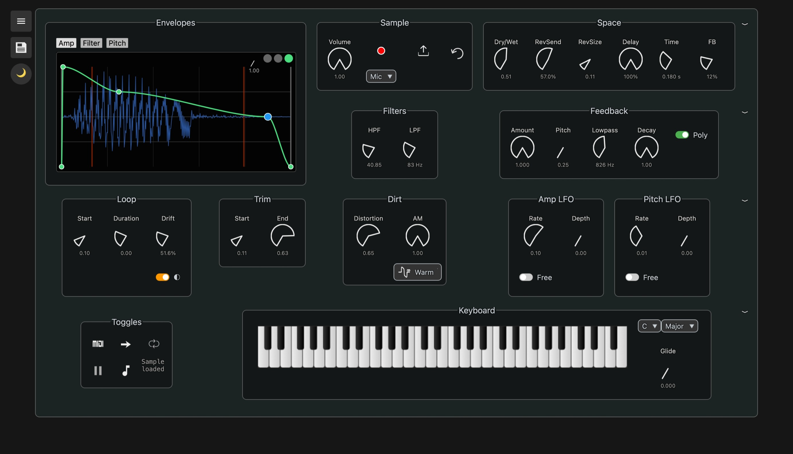

# Hljóð-Smali

A polyphonic sampler that runs in the browser.

**[Try Hljóð-Smali](https://kristinnroach.github.io/hljod-smali/)**



Hljóð-Smali is built with [`@kidlib/web-audio`](https://github.com/KristinnRoach/web-audio), a library of high-level Web Audio primitives for building musical instruments and tools, still in active development.

## Features

- Record or upload samples and play them with a MIDI controller, computer keyboard, or on-screen keys
- Samples with a prominent pitch are detected and tuned to C, so they play polyphonically in tune with other instruments
- Shape playback with envelopes, filters, looping, trimming, modulation, and effects
- Build layered patches and save them locally in the browser
- Install as a PWA with light and dark themes

## Stack

TypeScript, SolidJS, Web Audio API, Web MIDI, IndexedDB, Vite+, Vitest, and Playwright.

## Run locally

```sh
pnpm install
pnpm dev
```

Build and test:

```sh
pnpm build
pnpm test
pnpm test:e2e
```

Originally developed in
[`sampler-monorepo`](https://github.com/KristinnRoach/sampler-monorepo). The UI is
maintained here, the audio engine in `@kidlib/web-audio`.

MIT licensed.
